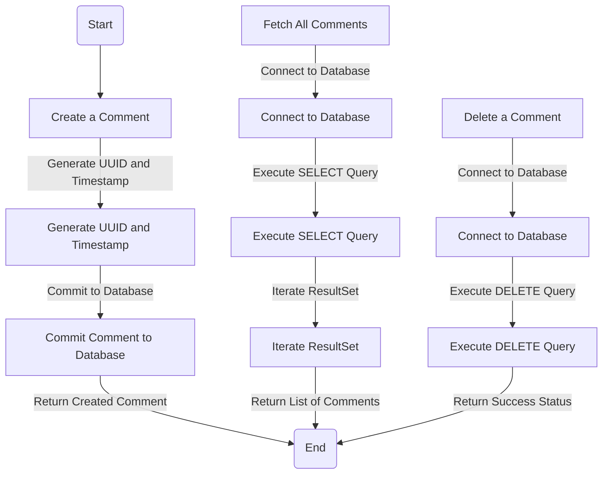
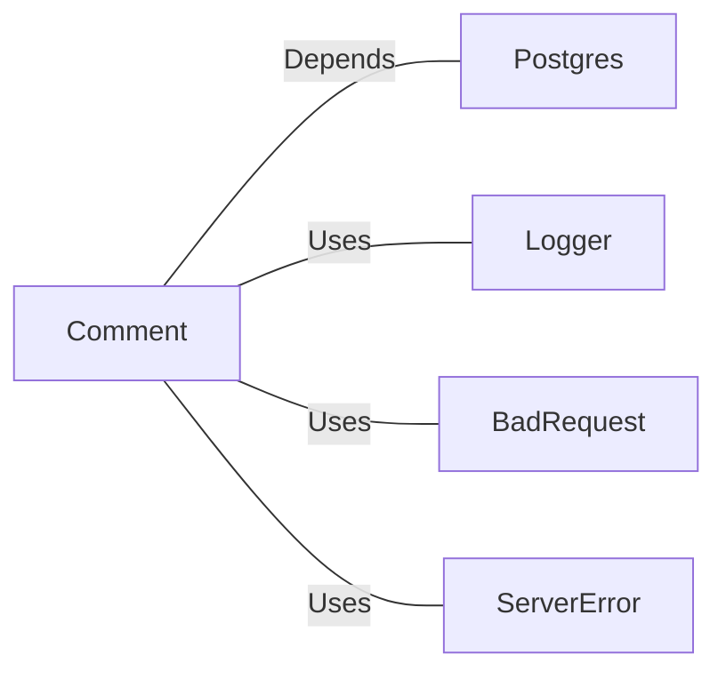

# Comment.java: Comment Management Class

## Overview
The `Comment` class is responsible for managing comments in a system. It provides functionality to create, fetch, and delete comments, as well as commit them to a database. The class interacts with a PostgreSQL database to perform these operations.

## Process Flow


## Insights
- **Comment Creation**: Generates a unique ID and timestamp for each comment and commits it to the database.
- **Fetching Comments**: Retrieves all comments from the database using a `SELECT` query and maps the result set to `Comment` objects.
- **Deleting Comments**: Deletes a specific comment from the database using its ID.
- **Error Handling**: Uses custom exceptions (`BadRequest` and `ServerError`) for error handling during comment creation.
- **Database Connection**: Relies on a `Postgres.connection()` method to establish connections to the database.

## Dependencies


- `Postgres`: Provides the `connection()` method to interact with the PostgreSQL database.
- `Logger`: Used for logging errors during database operations.
- `BadRequest`: Custom exception thrown when a comment cannot be saved.
- `ServerError`: Custom exception thrown for server-side errors.

## Data Manipulation (SQL)
### Table Structure: `comments`
| Attribute   | Data Type   | Description                          |
|-------------|-------------|--------------------------------------|
| `id`        | `VARCHAR`   | Unique identifier for the comment.  |
| `username`  | `VARCHAR`   | Username of the comment author.     |
| `body`      | `TEXT`      | Content of the comment.             |
| `created_on`| `TIMESTAMP` | Timestamp when the comment was created. |

### SQL Operations
- **INSERT**: Adds a new comment to the `comments` table.
  ```sql
  INSERT INTO comments (id, username, body, created_on) VALUES (?,?,?,?)
  ```
- **SELECT**: Fetches all comments from the `comments` table.
  ```sql
  SELECT id, username, body, created_on FROM comments;
  ```
- **DELETE**: Deletes a comment from the `comments` table by ID.
  ```sql
  DELETE FROM comments WHERE id = ?;
  ```

## Vulnerabilities
1. **SQL Injection**:
   - The `fetchAll` method uses a raw SQL query without parameterized statements, making it vulnerable to SQL injection attacks.
   - Recommendation: Use `PreparedStatement` for the `SELECT` query to prevent SQL injection.

2. **Resource Management**:
   - The `Connection` object in `fetchAll` and `delete` methods is not properly closed in a `finally` block, which can lead to resource leaks.
   - Recommendation: Ensure all database connections are closed in a `finally` block or use try-with-resources.

3. **Error Logging**:
   - The `fetchAll` method logs errors using `Logger` but does not propagate them, potentially hiding critical issues.
   - Recommendation: Propagate exceptions or return meaningful error responses.

4. **Exception Handling**:
   - The `create` method catches all exceptions and wraps them in a `ServerError`, which may obscure the root cause of the error.
   - Recommendation: Handle specific exceptions and provide detailed error messages.

5. **Timestamp Usage**:
   - The `createdOn` attribute is directly set using `new Timestamp(new Date().getTime())`, which may lead to timezone-related issues.
   - Recommendation: Use a standardized timezone or UTC for timestamps.
