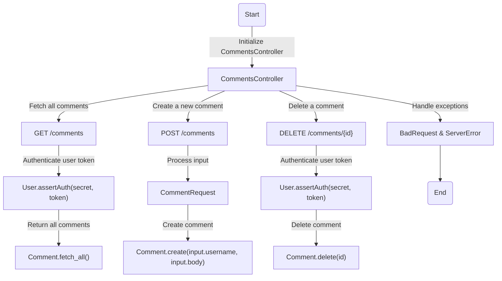
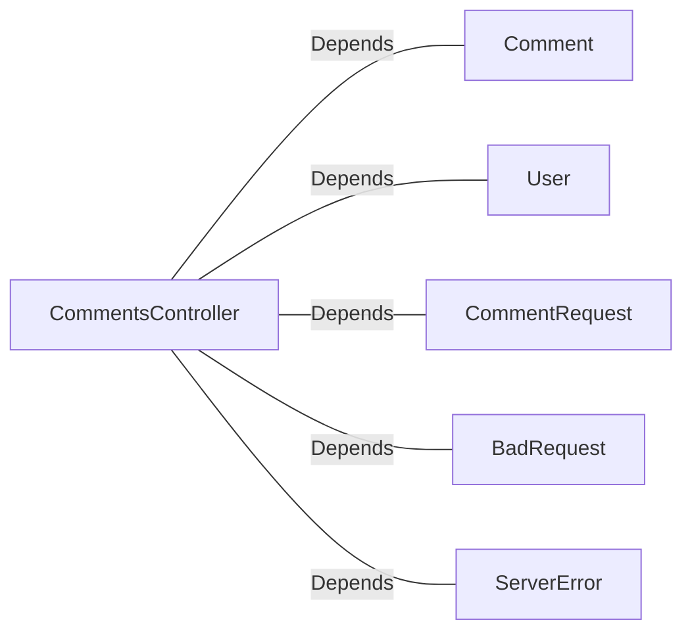

# CommentsController.java: REST API for Comment Management

## Overview
The `CommentsController` class provides a REST API for managing comments. It includes endpoints for fetching, creating, and deleting comments. The class also handles authentication using a secret value and token-based validation. Additionally, it defines custom exceptions for handling bad requests and server errors.

## Process Flow

## Insights
- **Authentication**: The API uses token-based authentication (`x-auth-token`) and validates it against a secret value.
- **Cross-Origin Resource Sharing (CORS)**: The endpoints are restricted to requests originating from `http://trusted-domain.com`.
- **Custom Exceptions**: `BadRequest` and `ServerError` classes are defined to handle specific error scenarios.
- **Logging**: Extensive logging is present throughout the code, but it is incorrectly placed outside of methods and may not execute as intended.
- **Comment Management**: The API provides methods to fetch all comments, create a new comment, and delete an existing comment.

## Dependencies

- `Comment`: Used for fetching, creating, and deleting comments.
- `User`: Used for authenticating user tokens.
- `CommentRequest`: Represents the input structure for creating a comment.
- `BadRequest`: Custom exception for handling bad requests.
- `ServerError`: Custom exception for handling server errors.

## Vulnerabilities
1. **Improper Logging Placement**:
   - Logging statements are placed outside of methods and may not execute as intended. This could lead to missing logs and debugging challenges.

2. **Hardcoded CORS Origin**:
   - The `@CrossOrigin` annotation restricts requests to `http://trusted-domain.com`. If this domain changes, the code must be updated manually, which is not scalable.

3. **Authentication Logic**:
   - The `User.assertAuth(secret, token)` method is called but its implementation is not provided. If this method does not properly validate tokens, it could lead to unauthorized access.

4. **Error Handling**:
   - The custom exceptions (`BadRequest` and `ServerError`) do not log the exception details or stack trace, which could make debugging more difficult.

5. **Potential Injection Vulnerability**:
   - The `Comment.create(input.username, input.body)` and `Comment.delete(id)` methods are called without sanitizing inputs. If these methods interact with a database, they could be vulnerable to SQL injection.

6. **Lack of Input Validation**:
   - The `CommentRequest` class does not validate `username` or `body`. Malformed or malicious input could lead to unexpected behavior or security issues.

## Data Manipulation (SQL)
If the `Comment` class interacts with a database, the following operations are implied:
- `Comment.fetch_all()`: Likely performs a `SELECT` operation to retrieve all comments.
- `Comment.create(input.username, input.body)`: Likely performs an `INSERT` operation to add a new comment.
- `Comment.delete(id)`: Likely performs a `DELETE` operation to remove a comment by its ID.

However, the exact SQL structure and attributes are not provided in the code.
