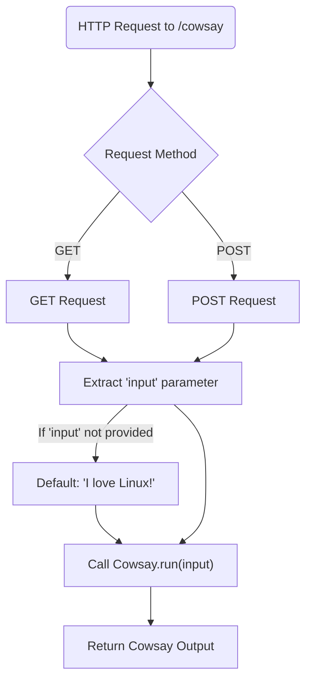
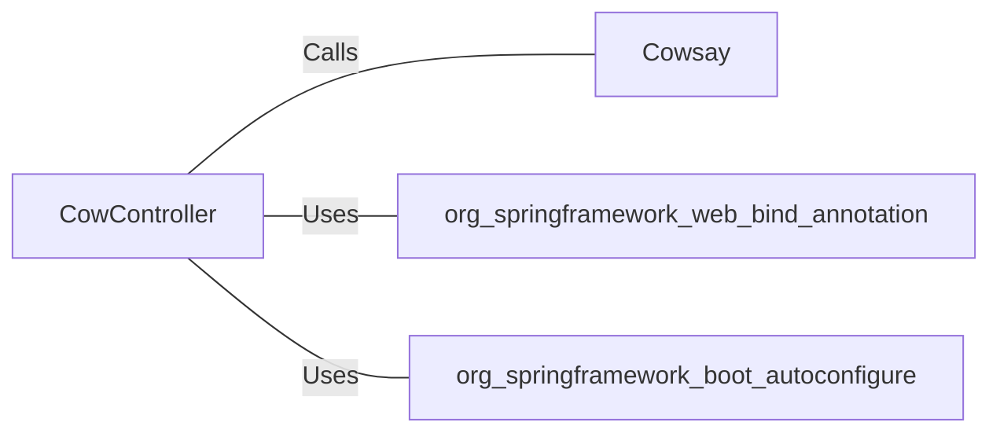

# CowController.java: Cow Controller for Handling Cowsay Requests

## Overview
The `CowController` class is a Spring Boot REST controller designed to handle HTTP requests for the `/cowsay` endpoint. It allows users to send a message, which is processed by the `Cowsay.run` method to generate a "cowsay" output.

## Process Flow

## Insights
- The `/cowsay` endpoint supports both `GET` and `POST` HTTP methods.
- The `input` parameter is optional; if not provided, it defaults to `"I love Linux!"`.
- The `Cowsay.run` method is responsible for generating the cowsay output based on the provided input.
- The controller uses Spring Boot annotations such as `@RestController` and `@EnableAutoConfiguration` for configuration and REST API functionality.

## Dependencies

- `Cowsay`: Processes the `input` parameter and generates the cowsay output.
- `org.springframework.web.bind.annotation`: Provides annotations for mapping HTTP requests to controller methods.
- `org.springframework.boot.autoconfigure`: Enables auto-configuration for Spring Boot applications.

## Vulnerabilities
- **Command Injection Risk**: If the `Cowsay.run` method executes system commands based on the `input` parameter, it may be vulnerable to command injection attacks. Proper sanitization and validation of the `input` parameter are necessary to mitigate this risk.
- **Denial of Service (DoS)**: If the `Cowsay.run` method performs resource-intensive operations, an attacker could exploit this by sending large or malicious inputs repeatedly, potentially causing a denial of service.
- **Unvalidated Input**: The `input` parameter is directly passed to `Cowsay.run` without validation, which could lead to unexpected behavior or security issues depending on the implementation of `Cowsay.run`.

## Recommendations
- Validate and sanitize the `input` parameter to prevent command injection and other input-related vulnerabilities.
- Implement rate limiting or input size restrictions to mitigate potential DoS attacks.
- Review the implementation of `Cowsay.run` to ensure it handles inputs securely and efficiently.
