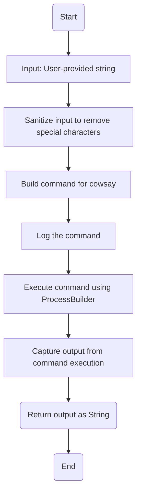
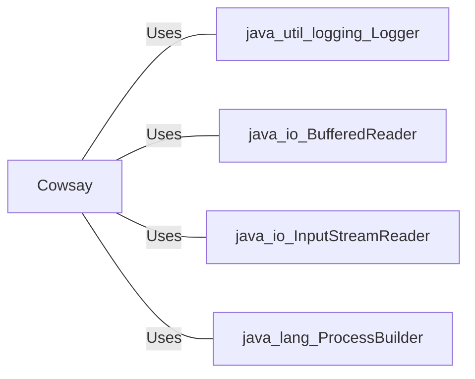

# Cowsay.java: Command Execution Wrapper for Cowsay

## Overview
This program provides a wrapper for executing the `cowsay` command-line tool, which generates ASCII art of a cow saying a given message. It sanitizes the input to prevent certain characters and logs the command execution process. The program uses Java's `ProcessBuilder` to execute the command and captures the output.

## Process Flow

## Insights
- **Input Sanitization**: The program removes special characters (`"`, `'`, `\`) from the input string to prevent command injection vulnerabilities.
- **Logging**: The command being executed is logged using `Logger` for debugging purposes.
- **Command Execution**: The `ProcessBuilder` is used to execute the `cowsay` command in a bash shell.
- **Error Handling**: Errors during command execution are logged as warnings, but the program does not rethrow exceptions or provide detailed error handling.
- **Output Capture**: The program captures the output of the `cowsay` command and returns it as a string.

## Vulnerabilities
1. **Command Injection**: Although the input is sanitized to remove certain characters, the sanitization is incomplete and does not account for all possible injection vectors. For example, characters like `;`, `|`, `&`, and `$` are not removed, which could allow malicious input to execute arbitrary commands.
2. **Improper Error Handling**: The program logs exceptions but does not handle them effectively. This could lead to silent failures or incomplete output in case of errors.
3. **Hardcoded Command Path**: The path to the `cowsay` executable (`/usr/games/cowsay`) is hardcoded, which may not be portable across different systems.
4. **Debugging Information in Production**: Logging the command being executed could expose sensitive information in production environments.

## Dependencies

- `java.util.logging.Logger`: Used for logging command execution and errors.
- `java.io.BufferedReader`: Used to read the output of the executed command.
- `java.io.InputStreamReader`: Wraps the input stream of the process for reading.
- `java.lang.ProcessBuilder`: Used to execute the `cowsay` command.

## Data Manipulation (SQL)
No SQL data manipulation is present in this program.
