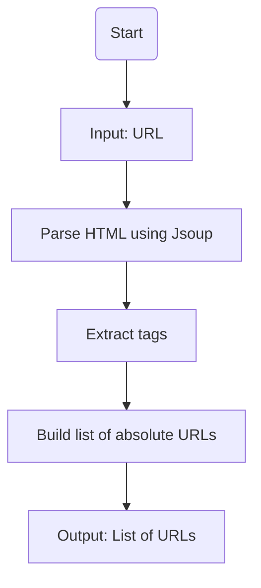
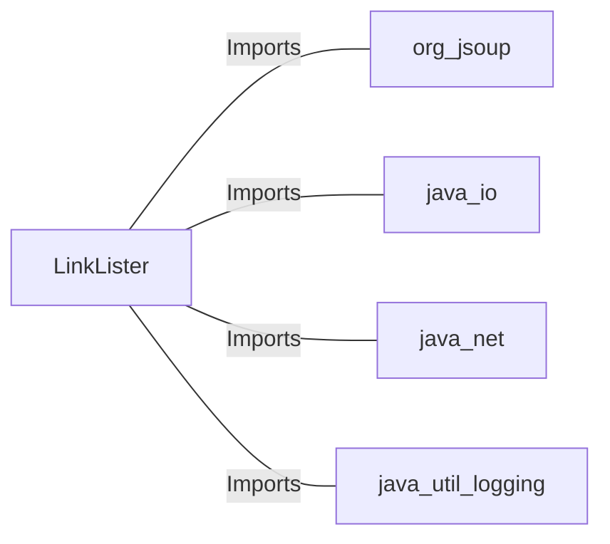

# LinkLister.java: Web Link Extraction Utility

## Overview
The `LinkLister` class provides functionality to extract hyperlinks from a given webpage URL. It uses the `Jsoup` library to parse HTML content and retrieve all anchor (`<a>`) tags. The class includes two methods for link extraction, with one offering additional logging capabilities.

## Process Flow

## Insights
- The `LinkLister` class is designed as a utility class with a private constructor to prevent instantiation.
- The `getLinks` method:
  - Connects to the provided URL using `Jsoup.connect(url).get()`.
  - Extracts all anchor (`<a>`) tags and retrieves their absolute URLs using `link.absUrl("href")`.
- The `getLinksV2` method:
  - Parses the URL using `java.net.URL` to extract the host.
  - Includes logging functionality to log the host of the URL.
- The class relies on the `Jsoup` library for HTML parsing and the `java.net.URL` class for URL manipulation.

## Dependencies

- `org.jsoup`: Used for HTML parsing and DOM manipulation.
- `java.io`: Provides `IOException` handling for network operations.
- `java.net`: Used for URL parsing and manipulation.
- `java.util.logging`: Used for logging host information in `getLinksV2`.

## Vulnerabilities
- **Unvalidated Input**: The `getLinks` method directly connects to the provided URL without validating it. This could lead to security risks such as SSRF (Server-Side Request Forgery).
- **Error Handling in `getLinksV2`**: The `getLinksV2` method does not handle potential exceptions from `URL` parsing or logging operations comprehensively, which could lead to runtime errors.
- **Logging Sensitive Information**: Logging the host of the URL in `getLinksV2` might expose sensitive information if the logs are not properly secured.
- **No Timeout Configuration**: The `Jsoup.connect(url).get()` call does not specify a timeout, which could lead to indefinite blocking in case of network issues.
- **Potential NullPointerException**: If the `absUrl("href")` method fails to retrieve a valid URL, it could result in a `NullPointerException`.

## Recommendations
- Validate the input URL before processing to prevent SSRF and other security risks.
- Implement comprehensive error handling for both methods.
- Avoid logging sensitive information or ensure logs are securely stored.
- Configure a timeout for `Jsoup.connect()` to prevent indefinite blocking.
- Check for null values when extracting URLs to avoid `NullPointerException`.
