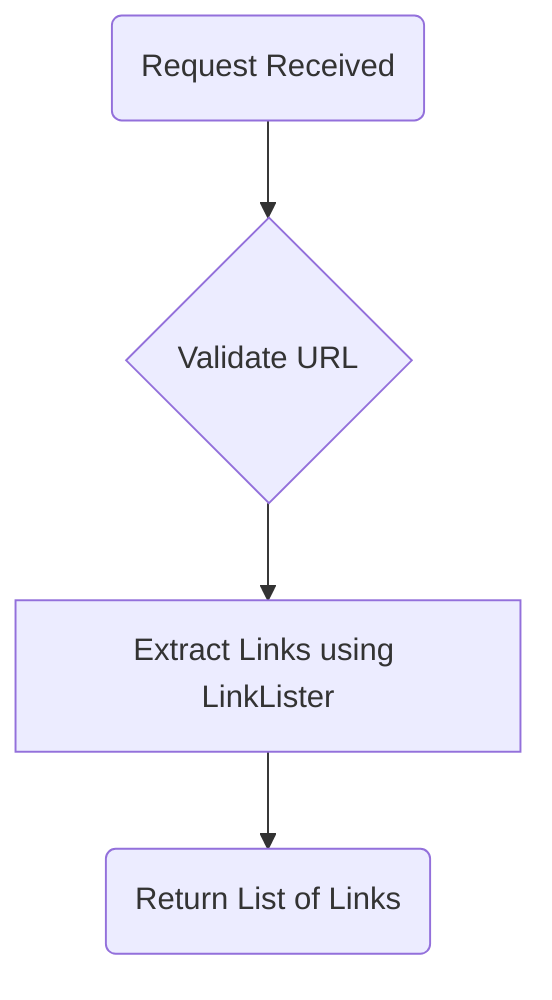
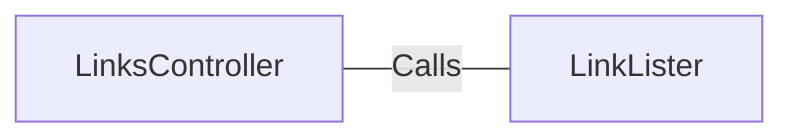

# LinksController.java: REST API for Link Extraction

## Overview
The `LinksController` class is a REST API controller that provides endpoints for extracting links from a given URL. It uses the `LinkLister` utility to perform the link extraction and supports two versions of the endpoint: `/links` and `/links-v2`.

## Process Flow

## Insights
- The class is annotated with `@RestController` and `@EnableAutoConfiguration`, making it a Spring Boot REST API controller with automatic configuration.
- Two endpoints are defined:
  - `/links`: Extracts links using the `LinkLister.getLinks` method.
  - `/links-v2`: Extracts links using the `LinkLister.getLinksV2` method, which may have additional validation or functionality.
- The `links` method throws `IOException`, indicating potential issues with URL processing or network operations.
- The `linksV2` method throws `BadRequest`, suggesting it performs stricter validation or error handling compared to the first version.

## Dependencies

- `LinkLister`: Provides methods `getLinks` and `getLinksV2` for extracting links from a given URL.

## Vulnerabilities
- **Potential Security Risk in URL Handling**: The `@RequestParam` directly accepts a URL from the user without validation or sanitization. This could lead to vulnerabilities such as Server-Side Request Forgery (SSRF) or injection attacks if the `LinkLister` methods do not properly validate the input.
- **Error Handling**: The `links` method throws `IOException`, but there is no explicit error handling or logging mechanism in place. This could result in unhandled exceptions and insufficient feedback to the client.
- **BadRequest Exception in `linksV2`**: The `BadRequest` exception is thrown, but its implementation is not shown. If not properly handled, it could lead to inconsistent error responses or expose internal details.

## Recommendations
- Implement input validation and sanitization for the `url` parameter to prevent SSRF and other injection attacks.
- Add proper error handling and logging mechanisms to ensure robust API behavior and better client feedback.
- Review the implementation of `LinkLister.getLinks` and `LinkLister.getLinksV2` to ensure secure and efficient link extraction.
