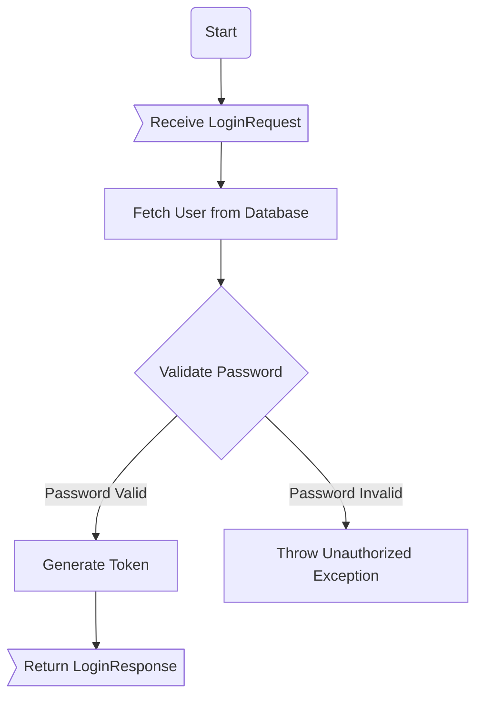
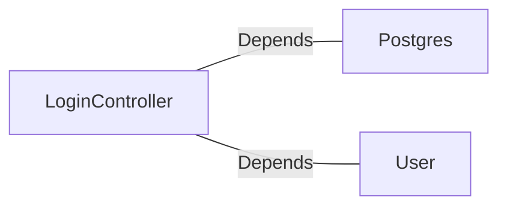

# LoginController.java: Login Authentication Controller

## Overview
The `LoginController` class is a REST API controller responsible for handling user login requests. It validates user credentials against stored data and generates a token for successful authentication. The controller uses Spring Boot annotations for configuration and routing.

## Process Flow

## Insights
- **Cross-Origin Resource Sharing (CORS):** The `@CrossOrigin` annotation allows requests from any origin, which could be a security risk if not properly configured.
- **Hardcoded Secret:** The `secret` is injected from application properties, but its usage in token generation should be carefully managed to avoid exposure.
- **Password Validation:** The password is hashed using `Postgres.md5` and compared with the stored hashed password. Ensure the hashing algorithm is secure and up-to-date.
- **Error Handling:** Unauthorized access results in throwing a custom `Unauthorized` exception with HTTP status 401.
- **Serialization:** Both `LoginRequest` and `LoginResponse` implement `Serializable`, ensuring compatibility for object serialization.

## Dependencies

- `Postgres`: Used for hashing the password with the `md5` method.
- `User`: Represents the user entity and provides methods like `fetch` and `token`.

### Identified External References
- `Postgres`: Provides the `md5` method for hashing passwords. Relation nature: Depends.
- `User`: Represents the user entity and provides methods for fetching user data and generating tokens. Relation nature: Depends.

## Vulnerabilities
1. **CORS Misconfiguration:**
   - Allowing all origins (`@CrossOrigin(origins = "*")`) can expose the application to cross-origin attacks. It is recommended to restrict origins to trusted domains.

2. **Weak Password Hashing:**
   - The use of `Postgres.md5` for password hashing may not be secure against modern attacks. Consider using a stronger hashing algorithm like bcrypt or Argon2.

3. **Hardcoded Secret:**
   - The `secret` used for token generation is injected from application properties. Ensure it is stored securely and rotated periodically.

4. **Potential User Enumeration:**
   - If the `User.fetch` method throws an exception or behaves differently for invalid usernames, it could allow attackers to enumerate valid usernames.

5. **Lack of Rate Limiting:**
   - The login endpoint does not implement rate limiting, making it vulnerable to brute-force attacks.

6. **Error Message Exposure:**
   - Throwing an `Unauthorized` exception with a specific message could expose sensitive information. Use generic error messages instead.

## Data Manipulation (SQL)
- **User Entity:** Likely interacts with a database to fetch user details. Ensure proper sanitization and validation of inputs to prevent SQL injection.
