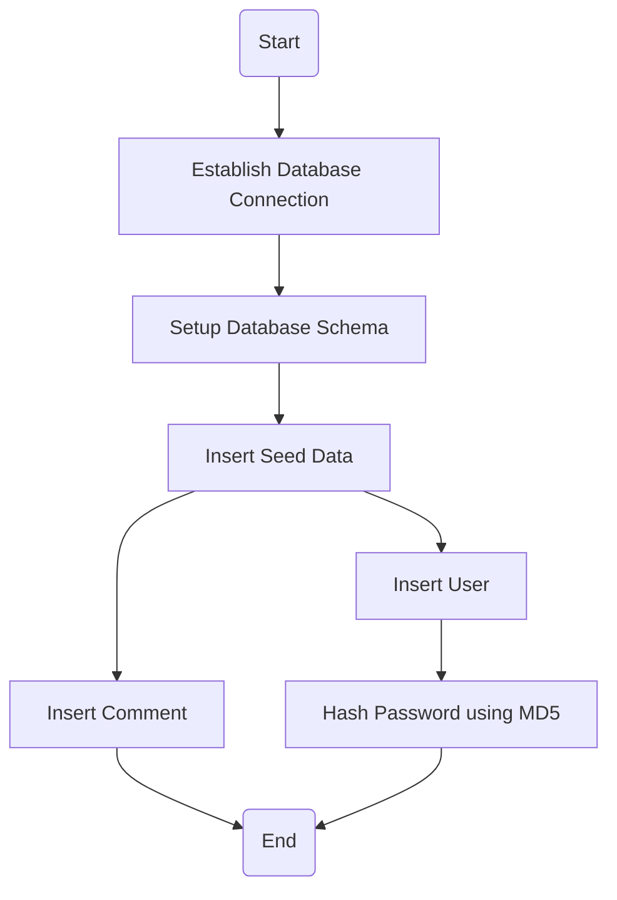
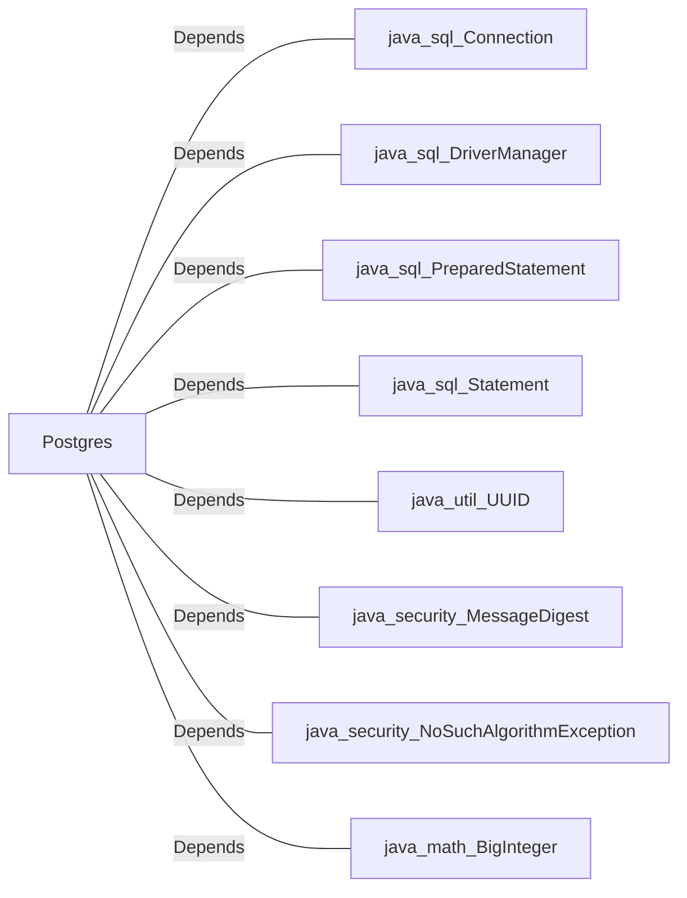

# Postgres.java: Database Setup and Interaction Utility

## Overview
The `Postgres` class is responsible for managing database connections, setting up schemas, inserting seed data, and providing utility methods for interacting with a PostgreSQL database. It includes methods for creating tables, inserting users and comments, and hashing passwords using MD5.

## Process Flow

## Insights
- **Database Connection**: The `connection()` method dynamically constructs the database connection URL using environment variables (`PGHOST`, `PGDATABASE`, `PGUSER`, `PGPASSWORD`).
- **Schema Setup**: The `setup()` method creates two tables (`users` and `comments`) and cleans up any existing data before inserting seed data.
- **Password Hashing**: The `md5()` method hashes passwords using MD5, which is considered insecure for sensitive contexts due to vulnerabilities like collision attacks.
- **Seed Data**: The `setup()` method inserts predefined users and comments into the database for initial setup.
- **Error Handling**: Error handling is minimal, with exceptions logged and the application exiting on failure.
- **UUID Usage**: Unique identifiers for users and comments are generated using `UUID.randomUUID()`.

## Vulnerabilities
1. **Insecure Password Hashing**:
   - MD5 is used for hashing passwords, which is vulnerable to collision attacks and brute force. A stronger hashing algorithm like bcrypt or Argon2 should be used for password storage.
   
2. **Hardcoded Seed Data**:
   - The seed data includes hardcoded usernames and passwords, which could lead to security risks if used in production environments.

3. **Error Handling**:
   - Exceptions are logged but not properly handled, leading to abrupt application termination (`System.exit(1)`).

4. **Environment Variable Exposure**:
   - Database credentials are retrieved from environment variables, which could be exposed if not properly secured.

5. **Potential SQL Injection**:
   - While `PreparedStatement` is used, the lack of input validation for `username` and `body` in `insertComment()` could lead to potential SQL injection risks if the input is not sanitized.

## Dependencies

- `java.sql.Connection`: Used for establishing database connections.
- `java.sql.DriverManager`: Used for managing database drivers and connections.
- `java.sql.PreparedStatement`: Used for executing parameterized SQL queries.
- `java.sql.Statement`: Used for executing SQL statements.
- `java.util.UUID`: Used for generating unique identifiers.
- `java.security.MessageDigest`: Used for hashing passwords.
- `java.security.NoSuchAlgorithmException`: Handles exceptions related to unsupported hashing algorithms.
- `java.math.BigInteger`: Used for converting byte arrays into hexadecimal strings.

## Data Manipulation (SQL)
### Table Structures
#### `users`
| Attribute    | Type          | Description                                      |
|--------------|---------------|--------------------------------------------------|
| `user_id`    | VARCHAR(36)   | Primary key, unique identifier for the user.     |
| `username`   | VARCHAR(50)   | Unique username for the user.                    |
| `password`   | VARCHAR(50)   | Hashed password of the user.                     |
| `created_on` | TIMESTAMP     | Timestamp of user creation.                      |
| `last_login` | TIMESTAMP     | Timestamp of the last login.                     |

#### `comments`
| Attribute    | Type          | Description                                      |
|--------------|---------------|--------------------------------------------------|
| `id`         | VARCHAR(36)   | Primary key, unique identifier for the comment.  |
| `username`   | VARCHAR(36)   | Username of the commenter.                       |
| `body`       | VARCHAR(500)  | Content of the comment.                          |
| `created_on` | TIMESTAMP     | Timestamp of comment creation.                   |

### SQL Operations
- `CREATE TABLE`: Creates `users` and `comments` tables if they do not exist.
- `DELETE`: Cleans up existing data in `users` and `comments` tables.
- `INSERT`: Inserts seed data into `users` and `comments` tables.
