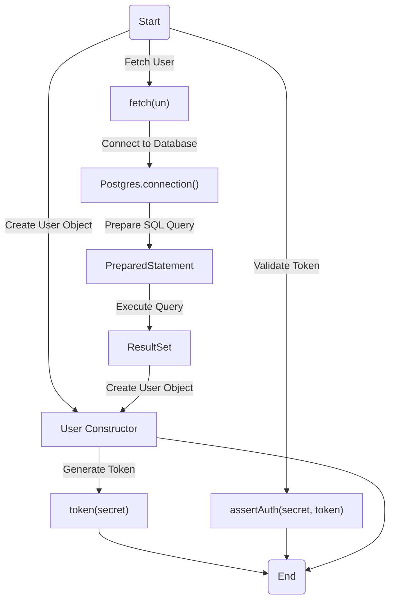
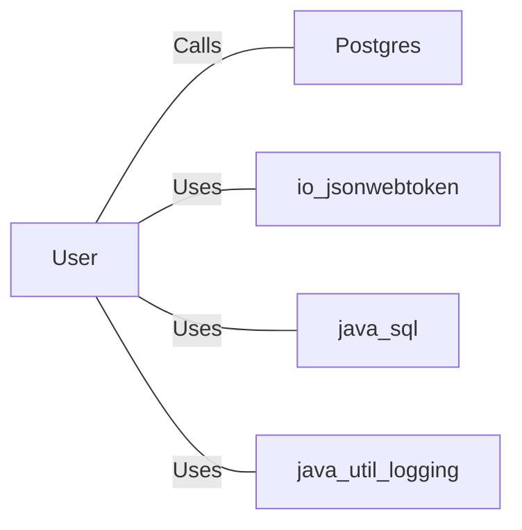

# User.java: User Management and Authentication

## Overview
The `User` class is responsible for managing user-related operations, including token generation, authentication, and fetching user details from a database. It provides methods for creating JWT tokens, validating them, and retrieving user information from a PostgreSQL database.

## Process Flow

## Insights
- The `token` method generates a JWT token using the provided secret key and the username as the subject.
- The `assertAuth` method validates a JWT token using the provided secret key. If validation fails, it throws an `Unauthorized` exception.
- The `fetch` method retrieves user details from a PostgreSQL database based on the username. It uses both `Statement` and `PreparedStatement`, but the `Statement` usage introduces SQL injection risks.
- The class uses the `Logger` for logging operations, but there are redundant logging statements in the `fetch` method.
- The `fetch` method improperly closes the database connection, which could lead to resource leaks.

## Vulnerabilities
1. **SQL Injection**:
   - The `fetch` method constructs a query using string concatenation (`String query = "select * from users where username = '" + un + "' limit 1";`), which is vulnerable to SQL injection. Although a `PreparedStatement` is also used, the string concatenation query remains in the code.

2. **Improper Resource Management**:
   - The database connection (`Connection cxn`) is not properly closed in the `finally` block, which could lead to resource leaks.

3. **Duplicate Logging**:
   - The `fetch` method contains redundant logging statements (`logger.severe(e.getClass().getName() + ": " + e.getMessage());`), which could clutter logs and reduce readability.

4. **Unreachable Code**:
   - In the `token` method, the second `return jws;` statement is unreachable and will cause a compilation error.

5. **Error Handling**:
   - The `fetch` method does not handle exceptions effectively, leading to potential silent failures or incomplete error reporting.

## Dependencies

- `Postgres`: Provides the database connection. The `fetch` method calls `Postgres.connection()` to establish a connection to the database.
- `io.jsonwebtoken`: Used for JWT token generation and validation.
- `java.sql`: Used for database operations, including `Connection`, `Statement`, `PreparedStatement`, and `ResultSet`.
- `java.util.logging`: Used for logging messages and errors.

## Data Manipulation (SQL)
### Table Structure
| Attribute Name | Data Type | Description |
|----------------|-----------|-------------|
| user_id        | String    | Unique identifier for the user. |
| username       | String    | Username of the user. |
| password       | String    | Hashed password of the user. |

### SQL Operations
- **`SELECT`**: Retrieves user details from the `users` table based on the username.
  - Query: `SELECT * FROM users WHERE username = ? LIMIT 1`
  - Vulnerable Query: `select * from users where username = 'un' limit 1` (SQL Injection risk).
